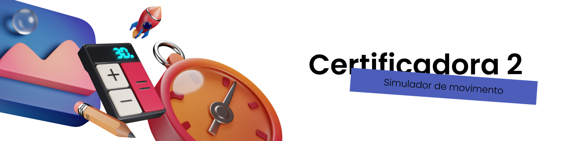

# Simulador de movimentos
Projeto desenvolvido para a disciplina de Certificadora de Competência 2.

 

## 🎬 Vídeo de apresentação
O vídeo de apresentação da aplicação pode ser acessada pelo [link](https://drive.google.com/file/d/1pfEYOtSfNR3swu8YAKpm425Cb3EkDRJe/view).

 

## 🗳️ Repositório
O repositório contendo o código deste projeto pode ser acessado através deste  [link](https://github.com/talita-aya/certificadora-2.git).

 

## 👩‍💻 Equipe

 - Gabriela Maria Lieira
 - Isabela Souza Pirola
 - Luanda Shibata de Jesus Vital
 - Talita Aya Sakamoto Kuriki

 

## 📝 Contextualização 
Para o desenvolvimento deste projeto foi escolhido um projeto de extensão, dentre todos os existentes, de modo que fosse possível aplicar os conhecimentos adquiridos ao longo do curso para resolver problemas dinâmicos e estruturados através de soluções tecnológicas.

Assim, o projeto escolhido para colaboração é o "[ELLP](https://grupoellp.com.br)", Ensino Lúdico de Lógica e Programação, que tem como objetivo compartilhar conhecimentos de lógica, programação, ciências, física e matemática com estudantes do ensino fundamental e médio da comunidade externa através de oficinas e eventos para a comunidade local e utilizando materiais desenvolvidos por estudantes voluntários.

 

## 📑 Descrição geral
    
O simulador contará com diferentes movimentos e cenários estudados na disciplina de física. O software contará com a entrada de determinados parâmetros para que, logo após, seja apresentado valores e resultados referentes a cada situação.

Deste modo, o professor conseguirá apresentar aos alunos as variações existentes nos movimentos simulados, como também proporcionar maior envolvimento na matéria ensinada.

 

## 📚 Movimentos
Levando em consideração os tópicos acima, foram definidos 2 movimentos diferentes que serão modelados a partir de sua cinemática ou dinâmica, seus parâmetros fixos e variáveis, além do formato das saídas do simulador.  Assim, para este projeto serão apresentados os seguintes movimentos:

 - Lançamento oblíquo
 - Plano inclinado sem atrito

 

## 💻 Desenvolvimento
Para a implementação do projeto a equipe utilizará estruturas de dados para desenvolvimento de determinadas funcionalidades, estas que serão listadas após a finalização completa do código.

Ademais, optou-se por utilizar [HTML](https://developer.mozilla.org/pt-BR/docs/Web/HTML), [CSS](https://developer.mozilla.org/pt-BR/docs/Web/CSS) e [JavaScript](https://developer.mozilla.org/pt-BR/docs/Web/JavaScript) para construção da aplicação para melhor experiência do usuário e apresentação visual dos exemplos físicos.

Já o progresso do projeto foi acompanhado através de uma  [Planilha Gantt](https://blog.runrun.it/planilha-de-gantt/#:~:text=O%20gr%C3%A1fico%20de%20gantt%20%C3%A9,a%20produtividade%20da%20sua%20%C3%A1rea.), contendo os status de todas as tarefas pendentes, os responsáveis, datas de início e fim, bem como estregas parciais e finais. Este cronograma completo pode ser visualizado através deste  [link](https://docs.google.com/spreadsheets/d/1qbgxmCJ9Iivr8_N4ZJ7DyNDE9fN0sk88/edit?usp=sharing&ouid=112152257061659035144&rtpof=true&sd=true).

 

## 🎨 Design
A interface do projeto foi desenvolvida utilizando a ferramenta  [Figma](https://www.google.com/url?sa=t&rct=j&q=&esrc=s&source=web&cd=&ved=2ahUKEwitvZDQr7mBAxUepZUCHXgoBgIQFnoECAcQAQ&url=https://www.figma.com/&usg=AOvVaw2ixWJnr7CgjXMg3QXfTz4u&opi=89978449), esta que permitiu criar um arquivo compartilhável e um protótipo do que seria desenvolvido, facilitando o entendimento geral, certificando que todos os requisitos e regras seriam seguidos e permitindo a estilização do sistema para uma interface amigável.

Deste modo, o design pode ser acessado através deste  [link](https://www.figma.com/file/ss9ay03SfhAUZWRk53YcQe/Simulador-de-Movimento?type=design&node-id=0%3A1&mode=design&t=Im1qehstFtwOetoz-1).

